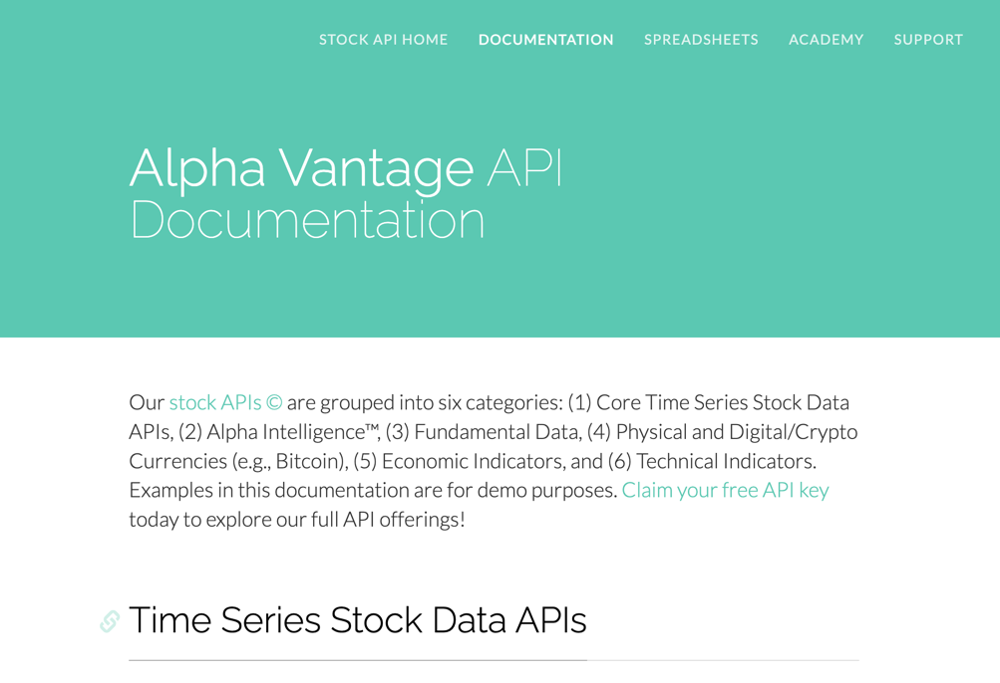

# Crawler
Tratto da [wikiepdia](https://it.wikipedia.org/wiki/Crawler):

Un crawler (detto anche web crawler, spider o robot), è un software che analizza i contenuti di una rete (o di un database) in un modo metodico e automatizzato, in genere per conto di un motore di ricerca. Nello specifico, un crawler è un tipo di bot (programma o script che automatizza delle operazioni), che solitamente acquisisce una copia testuale di tutti i documenti presenti in una o più pagine web creando un indice che ne permetta, successivamente, la ricerca e la visualizzazione.

## Alphavantage
   

[https://www.alphavantage.co/](https://www.alphavantage.co/ )

We are pleased to provide free stock API service for our global community of users for up to 5 API requests per minute and 500 requests per day. If you would like to target a larger API call volume, please visit premium membership.

Stock data APIs

## Binance
Client in Java per le API (con Retrofit ed OkHttp). Nato da una competizione indetta da Binance stessa.

```text
https://binance.zendesk.com/hc/en-us/articles/115002294131-Java-Winner-of-Binance-API-Competition

https://github.com/binance-exchange/binance-java-api
https://github.com/xcesco/binance-java-api
```

## Impostazione del progetto
L'idea di base è avere un crawler che recupera le informazioni dai vari exchange e li passi
ad un sistema di code, gestito, almeno in questa prima fase del progetto da Kafka.

Kafka, gestore di stream necessita di un gestore di stato e di un'interfaccia.

Il subscriber delle varie code deve essere un gestore della base dati, NoSQL o SQL per il momento
non è stato deciso. Si riporta di seguito un paio di link considerati utili.

Le prove saranno fatte grazie a docker e docker-compose.

```text
https://kafka.apache.org/
https://hub.docker.com/r/bitnami/kafka
https://towardsdatascience.com/overview-of-ui-tools-for-monitoring-and-management-of-apache-kafka-clusters-8c383f897e80

https://hub.docker.com/r/bitnami/kafka
https://developer.confluent.io/learn/kraft/
https://github.com/provectus/kafka-ui
```
Kafka, UI for Apache Kafka, 


## Impostazione del progetto
